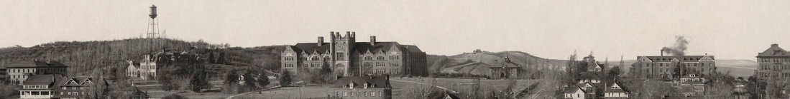

## University of Idaho Web Archive Collections

To ensure continued access to the unique born-digital content made available on the university website, University of Idaho Library captures university communications in their original web context on an annual basis. 
Select material from these harvests are made available in our digital collections. 
For more information, additional web archive material, or to view web content closer to how it was originally intended please contact [Special Collections and Archives](https://www.lib.uidaho.edu/special-collections/contactus.html).

Available collections:

- [The Friday Letter](https://www.lib.uidaho.edu/digital/fridayletter/)
- [University of Idaho News](https://www.lib.uidaho.edu/digital/uinews/index.html)
- [Malcolm M. Renfrew Interdisciplinary Colloquium Web Archive](https://www.lib.uidaho.edu/digital/mric/)
- [First Monday Newsletter](https://www.lib.uidaho.edu/find/firstmondaynewsletter/)

*Note: this portal is under development and subject to change.*
